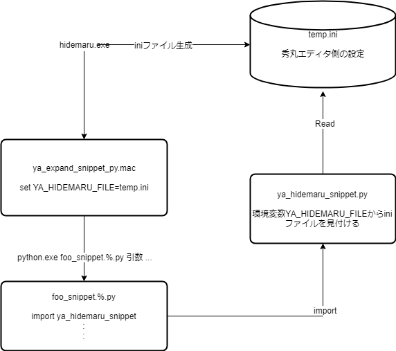

# 秀丸エディタとPythonのバインド方法

# はじめに

Pythonを利用したスニペットから秀丸エディタ側の情報を取得する方法の備忘録です。


# スニペットの例

以下のスニペットを参照してください。

`snippets\functions\text-mode\markdown-mode\table.py`

```python
import ya_hidemaru_snippet

# スニペットのモジュールディレクトリを秀丸エディタから取得する
ya_hidemaru_snippet.module_dir()
```

# 概要図

予め秀丸エディタ側の情報を ini ファイルへ出力することで実現しています。

プロセスを超えて情報を受け渡しするためにこのような方法にしました。



# ファイルの説明

|ファイル名|説明|
|:--:|:--:|
|yas_pytyhon_bind.drawio|https://www.draw.io/|


