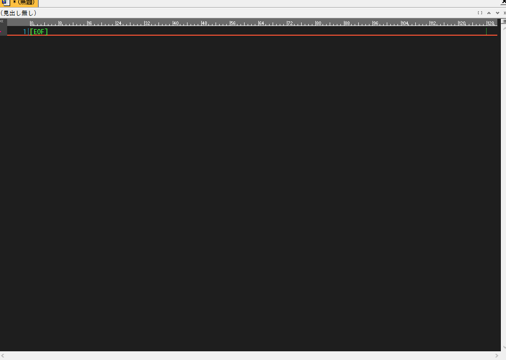

秀丸エディタの動的スニペット (Yet Another Hidemaru Snippet)
========

- [これは何？](#これは何)
- [開発の経緯](#開発の経緯)
- [特徴](#特徴)
- [スクリーンショット](#スクリーンショット)
- [マクロの思想](#マクロの思想)
- [対応言語](#対応言語)
- [マクロの導入方法](#マクロの導入方法)
- [ユーザー定義のスニペット作成](#ユーザー定義のスニペット作成)
- [動作環境](#動作環境)
- [ダウンロード](#ダウンロード)
- [連絡先](#連絡先)
- [謝辞](#謝辞)

# これは何？

秀丸エディタ用の**動的**スニペットマクロです。

# 開発の経緯

秀丸エディタ用のスニペットマクロは色々と公開されていますが、それらは**静的**スニペットで固定的なテキストしか生成できません。

「可変個の引数・テキストを書いている状況」に応じてスニペットを生成したく、**動的**スニペットマクロ(Yet Another Hidemaru Snippet)を作成しました。

# 特徴

このマクロではスニペットに、

- [動的なスニペット]　秀丸マクロ・Python・VBScript・JavaScript・WindowsBatch
- [静的なスニペット]　テキストファイル

の両方を使用できます。 
従来の静的スニペットに加えて「可変個の入力・テキストを書いている状況」に応じた**動的スニペット**を利用できます。

論より証拠、 
「動的スニペット・静的スニペット」の動作を以下スクリーンショットでご確認下さい。

# スクリーンショット
## スクリーンショット(C#)

## スクリーンショット(C/C++ 基本)

## スクリーンショット(C/C++ class)

## スクリーンショット(C/C++ include guarder)

## スクリーンショット(Python class)

## スクリーンショット(MarkDown)

|コマンド|動作|
|:--:|:--:|
|toc	|目次(Table Of Contents)の挿入|
|table	|テーブルの挿入|
|image	|imageのテンプレートを挿入|
|link	|linkのテンプレートを挿入|

## スクリーンショット(Hidemaru macro)

## スクリーンショット(Text)

|コマンド|動作|
|:--:|:--:|
|date|日にちの挿入|
|time|時間の挿入|
|@rep|文字列の繰り返しを挿入|

## スクリーンショット(Command prompt)

|コマンド|動作|
|:--:|:--:|
|@cmd|コマンドプロンプトの実行|

コマンドプロンプトを実行して、

- カレントディレクトリのファイル一覧
- フォルダ構造
- 環境変数

などを取得できます。

## スクリーンショット（スニペット挿入GUI） 

空行でマクロを実行するとスニペット挿入GUIが起動します。

スニペットを選んでから引数を入力すると秀丸エディタへスニペットを挿入できます。 
このマクロを使い始めたとき「どんなスニペットがあるのか分からず途方に暮れる」という問題を解決するために用意しました。

# マクロの思想

このマクロ（動的スニペット）は**１つのテキストから１００のテキストを一気に作る**という思想で作成しています。逆に、静的スニペットは**１００のテキストを少ないキー打鍵で作る**という考えです。

それぞれに優劣は無く高い山を西から登るか東から登るかの違いです。なので、スニペットの選択肢が１つ増えたと思って下さい😘

# 対応言語

ディフォルトで以下のスニペット定義を用意しています。

- BAT
- C#
- C/C++
- Cuda
- FX
- Go
- Hidemaru macro
- Html
- Markdown
- Perl
- PHP
- Python
- Text

もちろん、ユーザー独自のスニペットを追加することも出来ます！
（追加方法は後述で）

#### C/C++/C#のスニペット定義について

VisualStudioのスニペット定義を可能な範囲で移植しています。

#### Textのスニペットについて

[TextMate](https://macromates.com/) のスニペット定義を可能な範囲で移植しています。

# マクロの導入方法

まずは、動作確認を行った安定バージョンをダウンロードして下さい。
https://github.com/ohtorii/ya_hidemaru_snippet/releases

masterブランチを取得しても多分動作しないです。（動作確認を行っていないため）

## ディレクトリ構成

全ファイルとフォルダを秀丸エディタのスクリプトディレクトリにコピーしてください。

コピー後のディレクトリ構成

	hidemaru_macrodir
	  └─ya_hidemaru_snippet
	     ├─ya_hidemaru_snippet.mac
	     ├─config.ini
	     ├─doc
	     ├─internal
	     └─snippets

## ショートカットキー割り当て

`ya_hidemaru_snippet.mac` をショートカットキーに割り当てて下さい。 

### 割り当ての例

- Ctrl-Enter
- Alt-Enter

ちなみに、私はCtrl-Enterに割り当てています。（なんか、えいやー という感じなので）

## 動作のカスタマイズ

マクロの動作をカスタマイズするには[doc/customize.md](doc/customize.md)を参照して下さい。

# ユーザー定義のスニペット作成

ユーザー定義のスニペットを作成するには[doc/snippet_spec.md](doc/snippet_spec.md)を参照して下さい。

# 動作環境

- 秀丸エディタ ver8以降
- でんがくDLL (http://www.ceres.dti.ne.jp/~sugiura/)
- ht_tools.dll (http://htom.in.coocan.jp/)

それぞれ最新版をご利用下さい。

# ダウンロード

こちらから動作確認済みのパッケージをダウンロードして下さい。 
https://github.com/ohtorii/ya_hidemaru_snippet/releases

### 注意
masterブランチを取得しても多分動作しないです。 
ブランチを作らずに気楽に開発してます。（仕事じゃないしね😉）

### バージョン番号のルール

バージョン番号の表記方法

バージョン番号は version 1.2.3 のように表記され、それぞれ major.minor.revision を表します。

|番号|説明|
|:--:|:--:|
|major|互換性が失われる大きな変更を表します|
|minor|機能追加のように互換性のある更新を表します|
|revision|バグ修正のように機能そのものに変化が無い軽微な更新を表します|

# 連絡先

<https://ohtorii.hatenadiary.jp>  
<https://twitter.com/ohtorii>  
<https://github.com/ohtorii>

# 謝辞

- [TextMate](https://macromates.com/) スニペット書式をかなり参考にしました。
- [emacs yasnippet](http://code.google.com/p/yasnippet/)
- [YASnippet Hidemarized](https://github.com/mobitan/yas/)
