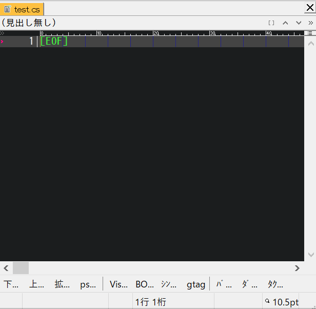
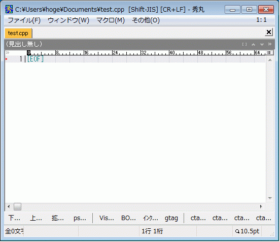
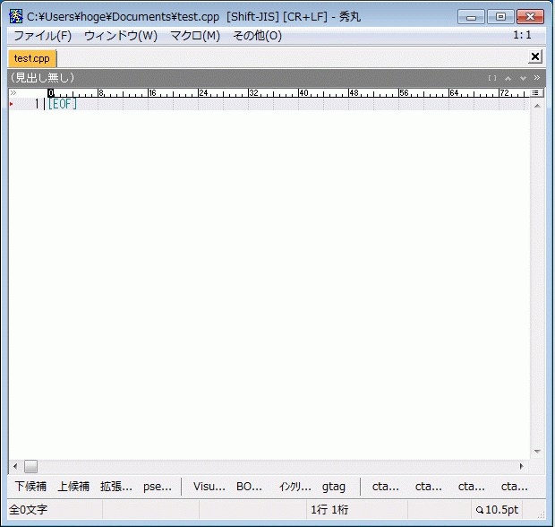
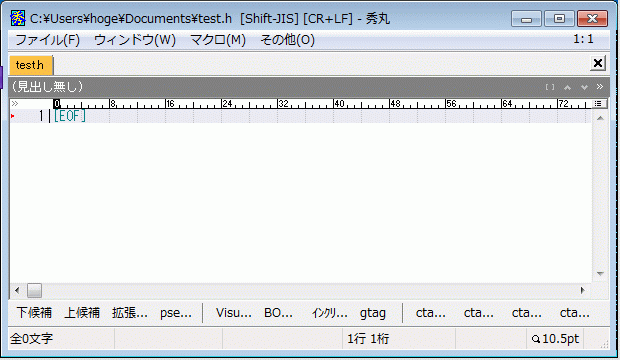
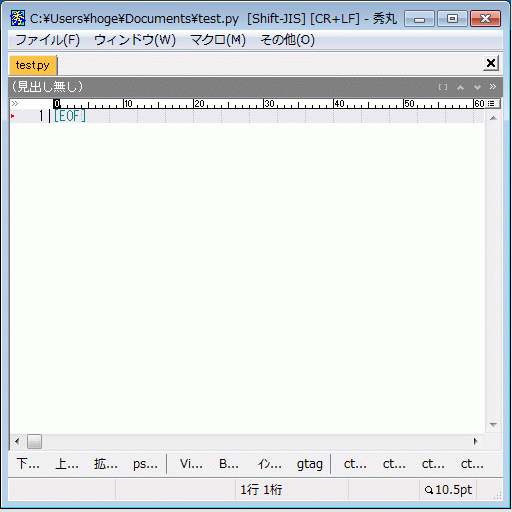
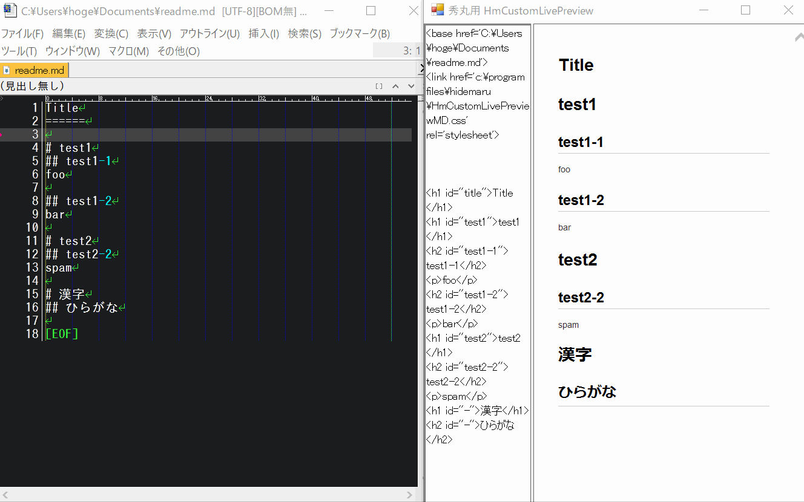
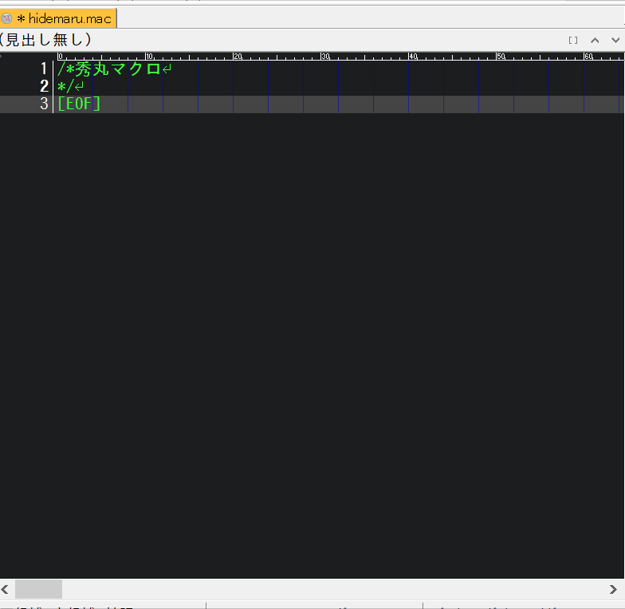
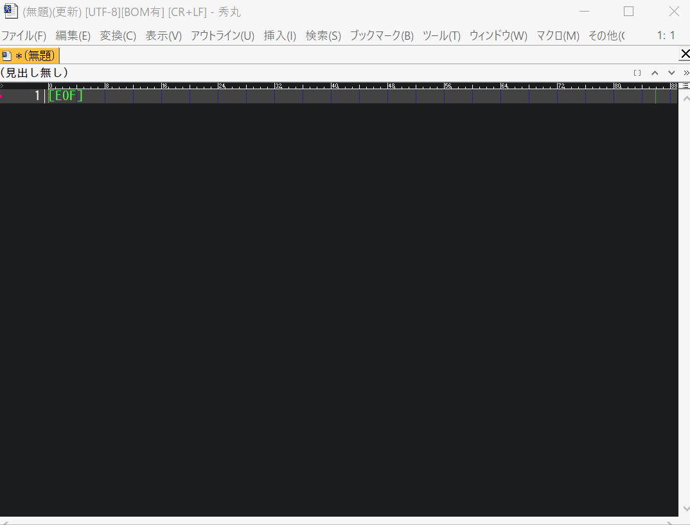
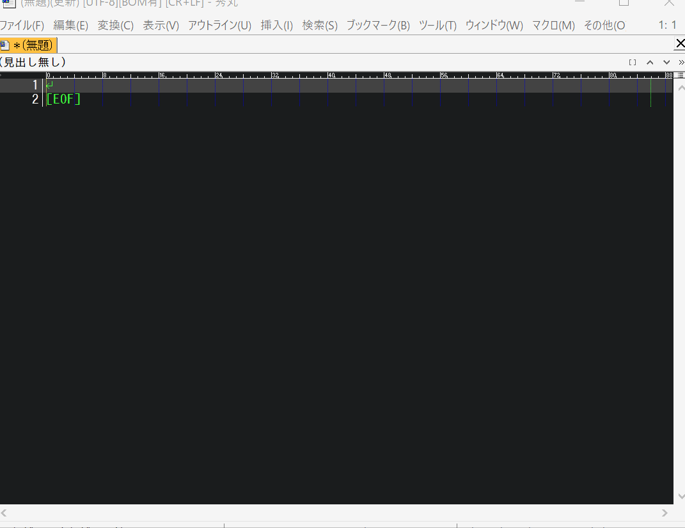

秀丸エディタの動的スニペット (Yet Another Hidemaru Snippet)
========

- [これは何？](#これは何)
- [開発の経緯](#開発の経緯)
- [特徴](#特徴)
- [スクリーンショット](#スクリーンショット)
- [マクロの思想](#マクロの思想)
- [対応言語](#対応言語)
- [マクロの導入方法](#マクロの導入方法)
- [スニペットのカスタマイズと新規作成](#スニペットのカスタマイズと新規作成)
- [動作環境](#動作環境)
- [更新履歴](#更新履歴)
- [バージョン番号のルール](#バージョン番号のルール)
- [ダウンロード](#ダウンロード)
- [連絡先](#連絡先)
- [謝辞](#謝辞)

# これは何？

秀丸エディタ用の**動的**スニペットマクロです。

# 開発の経緯

秀丸エディタ用のスニペットマクロは色々と公開されていますが、それらは**静的**スニペットで固定的なテキストしか生成できません。

「可変個の引数・テキストを書いている状況」に応じてスニペットを生成したく、**動的**スニペットマクロ(Yet Another Hidemaru Snippet)を作成しました。

# 特徴

このマクロではスニペットに、

- [動的なスニペット]　秀丸マクロ・Python・VBScript・JavaScript・WindowsBatch
- [静的なスニペット]　テキストファイル

の両方を使用できます。 
従来の静的スニペットに加えて「可変個の入力・テキストを書いている状況」に応じた**動的スニペット**を利用できます。

論より証拠、 
「動的スニペット・静的スニペット」の動作を以下スクリーンショットでご確認下さい。

# スクリーンショット
## スクリーンショット(C#)

## スクリーンショット(C/C++ 基本)

## スクリーンショット(C/C++ class)

## スクリーンショット(C/C++ include guarder)

## スクリーンショット(Python class)

## スクリーンショット(MarkDown)

|コマンド|動作|
|:--:|:--:|
|toc	|目次(Table Of Contents)の挿入|
|table	|テーブルの挿入|
|image	|imageのテンプレートを挿入|
|link	|linkのテンプレートを挿入|

## スクリーンショット(Hidemaru macro)

## スクリーンショット(Text)

|コマンド|動作|
|:--:|:--:|
|date|日にちの挿入|
|time|時間の挿入|
|@rep|文字列の繰り返しを挿入|

## スクリーンショット(Command prompt)

|コマンド|動作|
|:--:|:--:|
|@cmd|コマンドプロンプトの実行|

コマンドプロンプトを実行して、

- カレントディレクトリのファイル一覧
- フォルダ構造
- 環境変数

などを取得できます。

# マクロの思想

このマクロ（動的スニペット）は**１つのテキストから１００のテキストを一気に作る**という思想で作成しています。逆に、静的スニペットは**１００のテキストを少ないキー打鍵で作る**という考えです。

それぞれに優劣は無く高い山を西から登るか東から登るかの違いです。なので、スニペットの選択肢が１つ増えたと思って下さい😘

# 対応言語

ディフォルトで以下のスニペット定義を用意しています。

- BAT
- C#
- C/C++
- Cuda
- FX
- Go
- Hidemaru macro
- Html
- Markdown
- Perl
- PHP
- Python
- Text

もちろん、ユーザー独自のスニペットを追加することも出来ます！
（追加方法は後述で）

#### C/C++/C#のスニペット定義について

VisualStudioのスニペット定義を可能な範囲で移植しています。

#### Textのスニペットについて

[TextMate](https://macromates.com/) のスニペット定義を可能な範囲で移植しています。

# マクロの導入方法

まずは、動作確認を行った安定バージョンをダウンロードして下さい。
https://github.com/ohtorii/ya_hidemaru_snippet/releases

masterブランチを取得しても多分動作しないです。（動作確認を行っていないため）

## ディレクトリ構成

全ファイルとフォルダを秀丸エディタのスクリプトディレクトリにコピーしてください。

コピー後のディレクトリ構成

	hidemaru_macrodir
	  └─ya_hidemaru_snippet
	     ├─ya_hidemaru_snippet.mac
	     ├─config.ini
	     ├─doc
	     ├─internal
	     └─snippets

## キーアサイン

`ya_hidemaru_snippet.mac` をキー割り当てして下さい。 
（キー割り当ての例）

- Ctrl-Enter
- Alt-Enter

ちなみに、私はCtrl-Enterに割り当てています。（なんか、えいやー という感じなので）

## 動作環境のカスタマイズ

[動作環境のカスタマイズ](doc/customize.md)を参照して下さい。

# ユーザー定義のスニペット作成

[ユーザー定義のスニペット作成](doc/snippet_spec.md)を参照して下さい。

# 動作環境

- 秀丸エディタ ver8以降
- でんがくDLL (http://www.ceres.dti.ne.jp/~sugiura/)
- ht_tools.dll (http://htom.in.coocan.jp/)

それぞれ最新版をご利用下さい。

# 更新履歴

## ????/??/?? ver 2.??.??

### 新機能

スニペットの一覧表示と引数入力を行うダイアログを用意しました。（空行でスニペットマクロを実行するとダイアログが起動します） 
どんなスニペットが利用できるのか分からない……という問題に対する解決策の１つです。

### スニペットファイル追加
- golang(.go)
	- main.txt
- 秀丸マクロ(.mac)
	- if#r.txt
	- if$r.txt
	- ifr.txt
	- ife.%.txt
	- ife.txt
	- ifee.%.txt
	- ifee.txt
- バッチファイル(.BAT)
	- date.txt
	- e.txt
	- e0.txt
	- e1.txt
	- for.txt
	- ford.txt
	- fordr.txt
	- forf.txt
	- forfr.txt
	- if.txt
	- ife.txt
	- main.txt
	- sleep.%.mac
	- sleep.mac
	- time.txt
	- touch.%.txt
	- touch.txt

スニペットの詳細はそれぞれのファイル内容を確認して下さい😅

### 設定ファイル(config.ini)

Pythonのバージョン(2 or 3)に依存しないように内部処理を見直しました。
それに伴い、`config.ini`ファイルからPythonのバージョン情報に関する設定を削除しました。

### 非互換な更新（😱😱😱）

#### ディレクトリの整理

ディレクトリが無駄に深かったので整理しました。

	（旧）
	hidemaru_macrodir
	├─ya_hidemaru_snippet.mac
	└─ya_hidemaru_snippet		  ← このディレクトリを削除しました。
	    └─internal
	        ├─config.ini
	        └─snippets

	（新）
	hidemaru_macrodir
	└─ya_hidemaru_snippet
	    ├─ya_hidemaru_snippet.mac
	    ├─config.ini
	    └─snippets

上記図は重要なフォルダとファイルのみ表示しています。

##### 旧バージョンからのバージョンアップ方法

- 旧バージョンのフォルダをリネームしてから新バージョンをインストールして下さい。
	- 新バージョンが正しく動作することを確認できたら、リネームしたフォルダを削除して下さい。
- あなたが独自に作成したスニペットファイルは対応するディレクトリ(snippets\functions\text-mode)に移動することで引き続き利用できます。

#### スニペット仕様の変更（Pythonのみ）

- スニペットコード中で引数を受け取る方法をグローバル変数(argv[])からコマンドライン引数(sys.argv[])へ変更しました。

|区分|forループの例|
|:--:|--|
|(旧)|for index,value in enumerate(**argv[1:]**):|
|(新)|for index,value in enumerate(**sys.argv[2:]**):|

##### 詳細

	(旧) argv[]はグローバル変数。
		argv[0]	コマンド名
		argv[1]	引数
			:
			:
		argN[N]	引数
		
	(新) sys.argv[]はコマンドライン引数
		argv[0]	スニペットファイルへのパス   ←　新規追加の引数
		argv[1]	コマンド名
		argv[2]	引数
			:
			:
		argN[N]	引数

##### 具体例

以下のソースコードを参考にして下さい。 
*snippets\functions\text-mode\c-mode\c++-mode\template._.py*

#### スニペット（コマンド名の変更）
- @rep → repeat
- @his → @history

### 最後に

互換性を失う変更はヒデマラーの皆さんにも私にもダメージ🤕があります。 
これが最後になるように努めます😘😘😘

# バージョン番号のルール

バージョン番号の表記方法

バージョン番号は version 1.2.3 のように表記され、それぞれ major.minor.revision を表します。

|番号|説明|
|:--:|:--:|
|major|互換性が失われる大きな変更を表します|
|minor|機能追加のように互換性のある更新を表します|
|revision|バグ修正のように機能そのものに変化が無い軽微な更新を表します|

# ダウンロード

こちらから動作確認済みのアーカイブをダウンロードして下さい。 
https://github.com/ohtorii/ya_hidemaru_snippet/releases

*注意*
masterブランチを取得しても多分動作しないです。 
一人で開発しているのでブランチを作らずに気楽に開発してます。（仕事じゃないしね😉）

# 連絡先

<https://ohtorii.hatenadiary.jp>  
<https://twitter.com/ohtorii>  
<https://github.com/ohtorii>

# 謝辞

- [TextMate](https://macromates.com/) スニペット書式をかなり参考にしました。
- [emacs yasnippet](http://code.google.com/p/yasnippet/)
- [YASnippet Hidemarized](https://github.com/mobitan/yas/)
