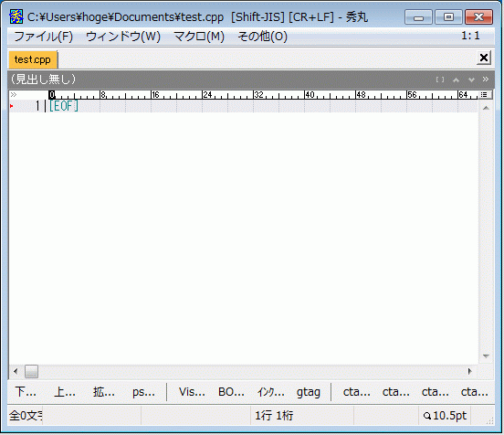
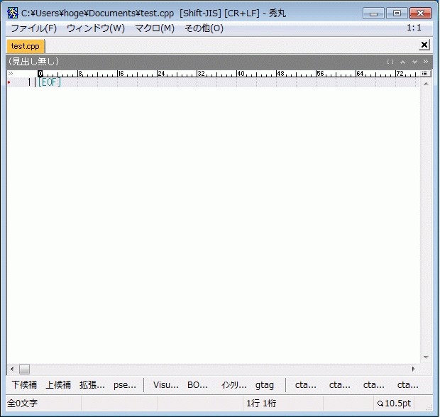
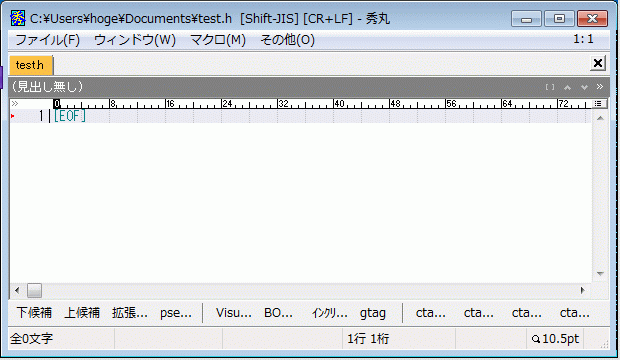
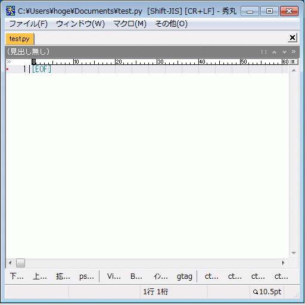
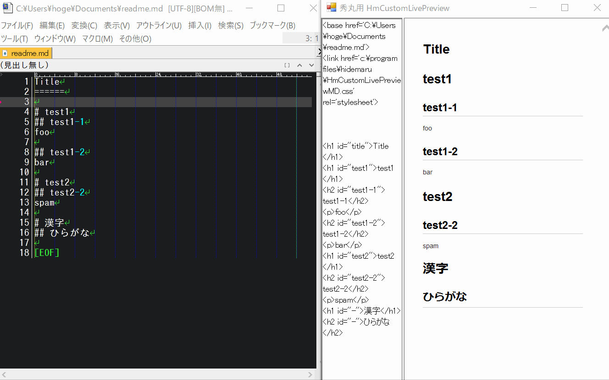
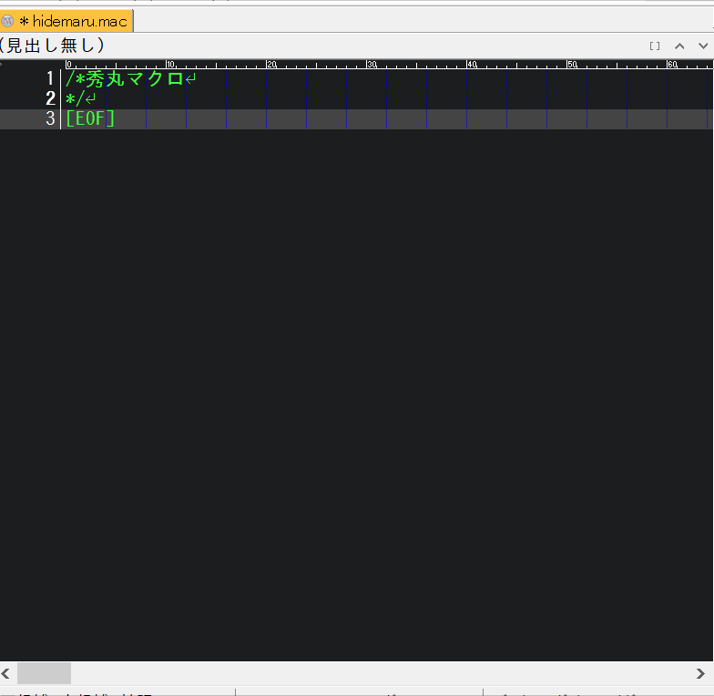
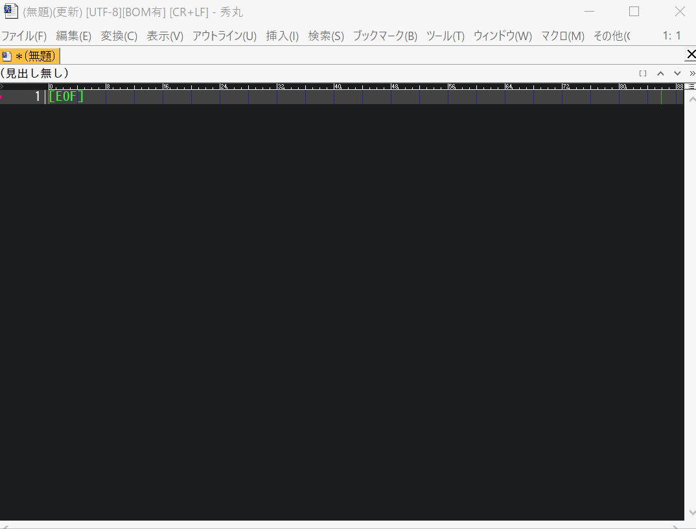

秀丸エディタの動的スニペット (Yet Another Hidemaru Snippet)
========

- [開発の経緯](#開発の経緯)
- [特徴](#特徴)
- [マクロの導入方法](#マクロの導入方法)
- [ファイル構成](#ファイル構成)
- [動作環境のカスタマイズ](#動作環境のカスタマイズ)
- [スニペットのカスタマイズと新規作成](#スニペットのカスタマイズと新規作成)
- [動作環境](#動作環境)
- [更新履歴](#更新履歴)
- [連絡先](#連絡先)
- [謝辞](#謝辞)

# 開発の経緯

過去に多くのスニペットマクロが公開されましたが、それらは全て**静的スニペット**展開でした。<br>
「可変個の入力・テキストを書いている状況」に応じた**動的スニペット**展開を行うためこのマクロを作成しました。

# 特徴

このマクロではスニペットに、
- [静的なスニペット]　テキストファイル
- [動的なスニペット]　秀丸マクロ・Python・VBScript・JavaScript・WindowsBatch

の両方を使用できます。<br>
従来の静的スニペットに加えて、可変個の入力に応じた**動的スニペット**を利用できます。

このマクロの「動的スニペット・静的スニペット」の動作は下記スクリーンショットで確認できます。

### スクリーンショット(C#)


### スクリーンショット(C/C++ basic)



### スクリーンショット(C/C++ class)



### スクリーンショット(C/C++ include guarder)



### スクリーンショット(Python class)



### スクリーンショット(MarkDown)



|コマンド|動作|
|:--:|:--:|
|toc	|目次(Table Of Contents)の挿入|
|table	|テーブルの挿入|
|image	|imageのテンプレートを挿入|
|link	|linkのテンプレートを挿入|

### スクリーンショット(Hidemaru macro)



### スクリーンショット(Text)



|コマンド|動作|
|:--:|:--:|
|date|日にちの挿入|
|time|時間の挿入|
|@rep|文字列の繰り返しを挿入|

### スクリーンショット(Command prompt)


|コマンド|動作|
|:--:|:--:|
|@cmd|コマンドプロンプトの実行|

コマンドプロンプトを実行して、

- カレントディレクトリのファイル一覧
- フォルダ構造
- 環境変数

などを取得できます。

### このマクロの思想

このマクロ（動的スニペット）は*１つのテキストから１００のテキストを一気に作る*という思想で作成しています。<br>
逆に、静的スニペットは*１００のテキストを少ないキー打鍵で作る*という考えです。<br>
それぞれに優劣は無く高い山を西から登るか東から登るかの違いです。

### 対応言語

ディフォルトで以下のスニペットを用意しています。

- C/C++
- C#
- cuda
- fx
- html
- markdown
- perl
- php
- python
- hidemaru-macro

もちろん、ユーザー独自のスニペットを追加することも出来ます！
（追加方法は後述で）

### コマンドの仕様

コマンド名 引数1 引数2 ... 引数N


# マクロの導入方法

全ファイルとフォルダを秀丸エディタのスクリプトディレクトリにコピーしてください。

	コピー後のディレクトリ構成
	hidemaru_macrodir
	│  ya_config_menu.mac
	│  ya_hidemaru_snippet.mac
	└─ya_hidemaru_snippet
	    ├─bonus
	    ├─doc
	    ├─image
	    ├─internal
	    └─snippets

## キーアサイン

`ya_hidemaru_snippet.mac` をキー割り当てして下さい。<br>
（キー割り当ての例）

- Ctrl-Enter
- Alt-Enter

ちなみに、私はCtrl-Enterに割り当てています。

ya_config_menu.mac は、この動的スニペットのマクロを更に便利にしたいときに利用します。<br>
なので、初めのうちは無理にキー割り当てをしなくても良いです。（そもそも説明をこれから書くような段階です。）

# ファイル構成

|ファイル名|説明|
|:---|:---|
|ya_hidemaru_snippet.mac|動的スニペットマクロの本体|
|ya_config_menu.mac|スニペットを更に便利に使うためのおまけマクロ|

# 動作環境のカスタマイズ

`\ya_hidemaru_snippet\internal\config.ini` で以下カスタマイズが可能です。
- Pythonのバージョン(2 or 3)切り替え
- ファイル拡張子とスニペットのモードを紐付ける

```ini
[config]
.txt=text-mode
.doc=text-mode
.text=text-mode
.c=text-mode\c-mode
.h=text-mode\c-mode\c++-mode
.cpp=text-mode\c-mode\c++-mode
.hpp=text-mode\c-mode\c++-mode
.inl=text-mode\c-mode\c++-mode
.cs=text-mode\c-mode\csharp-mode
.py=text-mode\python-mode
.pl=text-mode\perl-mode
.php=text-mode\php-mode
.html=text-mode\html-mode
.htm=text-mode\html-mode
.md=text-mode\markdown-mode
.fx=text-mode\fx-mode
.cg=text-mode\fx-mode
.cgfx=text-mode\fx-mode
.hlsl=text-mode\fx-mode
.mac=text-mode\hidemaru-macro-mode
.cu=text-mode\c-mode\cuda-mode
.bat=text-mode

[python]
;version="2"
version="3"

;exe="C:\Python27\python.exe"
;exe="C:\Python32\python.exe"
exe="python.exe"

[new_file]
;新規ファイル（拡張子無し）の時に使用するスニペットモード
ext=".cpp"
```

Pythonを利用したスニペットが動かないときは、[python]セクションをご自身の環境に合わせて修正して下さい。

# スニペットのカスタマイズと新規作成

スニペット定義は`ya_hidemaru_snippet\snippets\text-mode`フォルダ以下にあります。

まずは、以下ファイルをもとに改造するのが分かりやすいと思います。

|ファイル名|説明|
|:---|:---|
|email.txt|定型文を挿入する最も単純なスニペット|
|python-mode\if.txt|引数無しのスニペット|
|python-mode\if.%.txt|引数を一つ受け取るスニペット|
|c-mode\for.%.js|引数を一つ受け取りJavaScriptでスニペットを生成する|
|python-mode\def.%._.py|引数一つと可変個の引数を受け取りPythonでスニペットを生成する|
|c-mode\once.mac|秀丸マクロを利用したサンプル（秀丸エディタ固有の情報を取得してスニペットを生成します）|

### スニペットファイルの命名規則

|記号|意味|
|:---|:---|
|%|１つの引数|
|_|可変引数|

# 動作環境

- 秀丸エディタ ver8以降
- でんがくDLL (http://www.ceres.dti.ne.jp/~sugiura/)
- ht_tools.dll (http://htom.in.coocan.jp/)

# 更新履歴

### 2018/12/02 ver 1.1.0
- テキストの選択範囲をスニペットとして認識するようにしました。
- 利用頻度の低いスニペットは削除して高いスニペットは機能強化を行いました。
- DLLの検索パスをhidemarudirとmacrodirの２箇所に変更しました。

### 2018/09/29 ver 1.0.0

- インストール方法やスニペットの定義方法などを追加

### 2012/09/24 ver 0.5.0

- GitHubにソースコードを公開

# ダウンロード

こちらから動作確認済みのアーカイブをダウンロードして下さい。<br>
https://github.com/ohtorii/ya_hidemaru_snippet/releases

*注意*
masterブランチを取得しても多分動作しないです。<br>
私が一人で開発しているのでブランチを作らずに気楽に開発してます。

# 連絡先

<https://ohtorii.hatenadiary.jp> <br>
<https://twitter.com/ohtorii> <br>
<https://github.com/ohtorii>

# 謝辞

- [TextMate](https://macromates.com/) スニペット書式をかなり参考にしました。
- [emacs yasnippet](http://code.google.com/p/yasnippet/)
- [YASnippet Hidemarized](https://github.com/mobitan/yas/)
